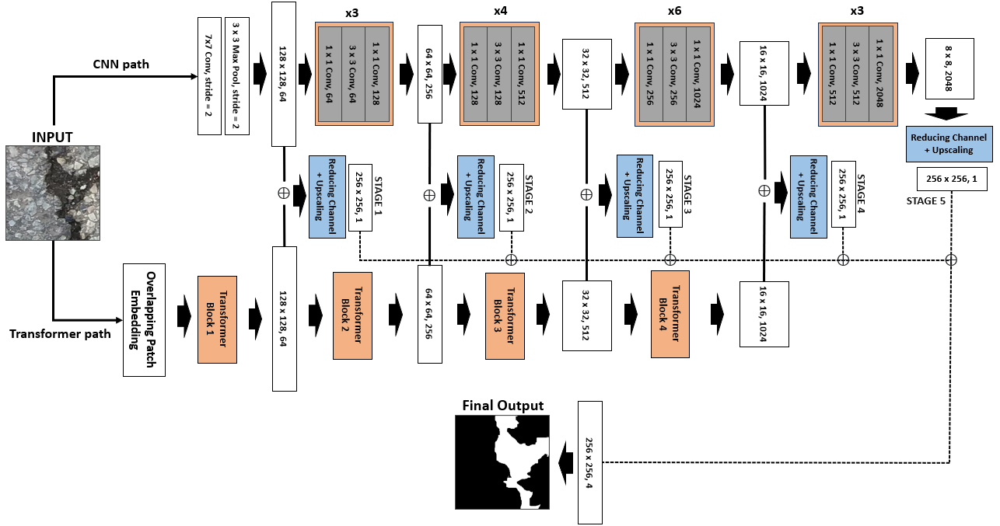

## Hybrid-Segmentor: A Hybrid Approach to Automated Damage Detection on Civil Infrastructure

## Model Architecture


You can download Hybrid-Segmentor model weights from [this link](https://1drv.ms/u/s!AtFigR8so_SspuEIg4jDbJNfgGGjyA?e=RNcOGu)
#### If you use our model in your research, please cite "Hybrid-Segmentor Reference" below.


## Refined Dataset
The refined dataset is developed with 13 publicly available datasets that have been refined using image processing techniques.

**Please note that the use of our dataset is RESTRICTED to non-commercial research and educational purposes.**

You can download the dataset from [this link](https://onedrive.live.com/?authkey=%21AAqG9xQnIlHYoyo&cid=ACF4A32C1F8162D1&id=ACF4A32C1F8162D1%21163379&parId=root&o=OneUp).
|Folder|Sub-Folder|Description|
|:----|:-----|:-----|
|`train`|IMG / GT|RGB images and binary annotation for training|
|`test`|IMG / GT|RGB images and binary annotation for testing|
|`val`|IMG / GT|RGB images and binary annotation for validation|

#### To download the dataset from the link, please cite "Dataset Reference" below.


 - **Hybrid-Segmentor Reference**:
```

```
 - **Dataset Reference**:
```
1. Aigle-RN / ESAR / LCMS Datasets
@article{AEL_dataset,
  title={Automatic crack detection on two-dimensional pavement images: An algorithm based on minimal path selection},
  author={Amhaz, Rabih and Chambon, Sylvie and Idier, J{\'e}r{\^o}me and Baltazart, Vincent},
  journal={IEEE Transactions on Intelligent Transportation Systems},
  volume={17},
  number={10},
  pages={2718--2729},
  year={2016},
  publisher={IEEE}
}

2. SDNet2018 Datasets
@article{sdnet2018,
  title={SDNET2018: A concrete crack image dataset for machine learning applications},
  author={Maguire, Marc and Dorafshan, Sattar and Thomas, Robert J},
  year={2018},
  publisher={Utah State University}
}

3. Masonry Datasets
@article{masonry_dataset,
  author = {Dais, Dimitris and Bal, Ihsan Engin and Smyrou, Eleni and Sarhosis, Vasilis},
  doi = {10.1016/j.autcon.2021.103606},
  journal = {Automation in Construction},
  pages = {103606},
  title = {{Automatic crack classification and segmentation on masonry surfaces using convolutional neural networks and transfer learning}},
  url = {https://linkinghub.elsevier.com/retrieve/pii/S0926580521000571},
  volume = {125},
  year = {2021}
}

4. Crack500 Dataset
@inproceedings{crack500_dataset,
  title={Road crack detection using deep convolutional neural network},
  author={Zhang, Lei and Yang, Fan and Zhang, Yimin Daniel and Zhu, Ying Julie},
  booktitle={2016 IEEE international conference on image processing (ICIP)},
  pages={3708--3712},
  year={2016},
  organization={IEEE}
}

5. CrackLS315 / CRKWH100 / CrackTree260 / Stone331 Datasets
@article{Deep_crack_crackLS315,
  title={Deepcrack: Learning Hierarchical Convolutional Features for Crack Detection},
  author={Zou, Qin and Zhang, Zheng and Li, Qingquan and Qi, Xianbiao and Wang, Qian and Wang, Song},
  journal={IEEE Transactions on Image Processing},
  volume={28},
  number={3},
  pages={1498--1512},
  year={2019},
}

6. DeepCrack Dataset
@article{deepcrack_dataset,
title={DeepCrack: A Deep Hierarchical Feature Learning Architecture for Crack Segmentation},
author={Liu, Yahui and Yao, Jian and Lu, Xiaohu and Xie, Renping and Li, Li},
journal={Neurocomputing},
volume={338},
pages={139--153},
year={2019},
doi={10.1016/j.neucom.2019.01.036}
}

7-1. GAPS384
@article{FPHBN_gaps384, title={Feature Pyramid and Hierarchical Boosting Network for Pavement Crack Detection}, author={Yang, Fan and Zhang, Lei and Yu, Sijia and Prokhorov, Danil and Mei, Xue and Ling, Haibin}, journal={IEEE Transactions on Intelligent Transportation Systems}, year={2019}, publisher={IEEE} }

7.2 GAPS (original dataset) 
@inproceedings{GAPS_data_original, title={How to Get Pavement Distress Detection Ready for Deep Learning? A Systematic Approach.}, author={Eisenbach, Markus and Stricker, Ronny and Seichter, Daniel and Amende, Karl and Debes, Klaus and Sesselmann, Maximilian and Ebersbach, Dirk and Stoeckert, Ulrike and Gross, Horst-Michael}, booktitle={International Joint Conference on Neural Networks (IJCNN)}, pages={2039--2047}, year={2017} }

8.1 CFD Dataset
@article{CFD1,
title={Automatic road crack detection using random structured forests},
author={Shi, Yong and Cui, Limeng and Qi, Zhiquan and Meng, Fan and Chen, Zhensong},
journal={IEEE Transactions on Intelligent Transportation Systems},
volume={17},
number={12},
pages={3434--3445},
year={2016},
publisher={IEEE}
}

8.2 CFD Dataset
@inproceedings{CFD2,
title={Pavement Distress Detection Using Random Decision Forests},
author={Cui, Limeng and Qi, Zhiquan and Chen, Zhensong and Meng, Fan and Shi, Yong},
booktitle={International Conference on Data Science},
pages={95--102},
year={2015},
organization={Springer}
}
```

If you have any questions, please contact me: june.goo.21 @ ucl.ac.uk without hesitation.
